# Writeup de la Máquina Trust de Dockerlabs

Lo primero que hago es realizar un escaneo de todos los puertos que tenga abiertos la máquina con la herramienta nmap.

```bash
sudo nmap -p- --open -sS --min-rate 5000 -vvv -n -Pn 172.17.0.2 -oG allPorts
```
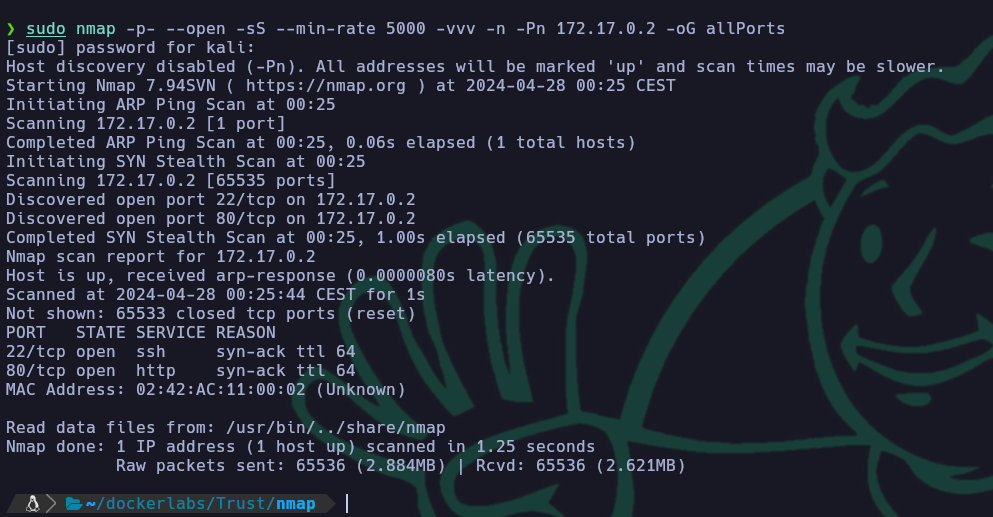

Una vez realizado el escaneo recojo los puertos abiertos con la utilidad extractPorts, del fichero donde se ha guardado el escaneo de nmap.

```bash
extractPorts allPorts
```
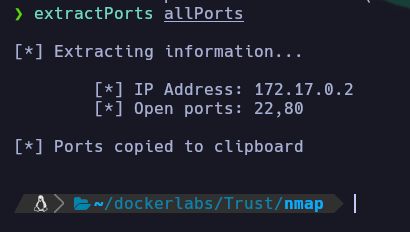

Ya con los puertos copiados les realizo un escaneo más concreto para determinar el servicio y la versión. El resultado del escaneo lo guardo en el archivo targeted. En este escaneo descubro que tiene el servicio OpenSSH en el puerto 22 y el servicio Apache2 en el puerto 80.

```bash
sudo nmap -p22,80 -sCV 172.17.0.2 -oN targeted
```

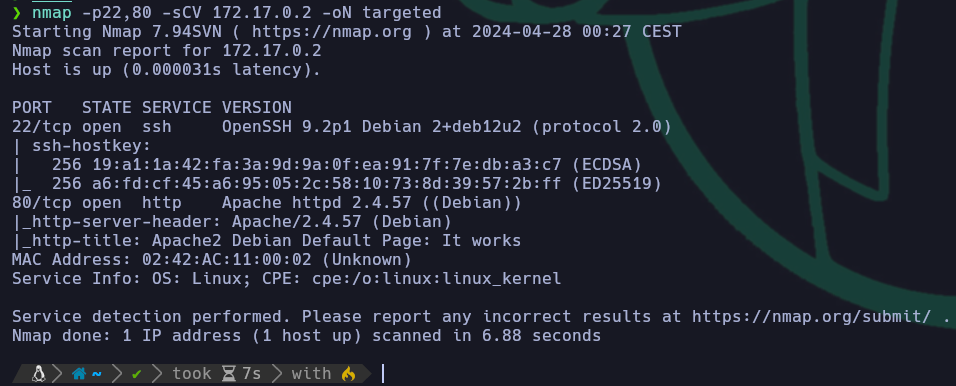

Viendo de primeras que esta el servicio de apache decido lanzar un whatweb para que identifique tecnologías que se esten utilizando. Este me reporta la página por defecto de apache.

```bash
whatweb http://172.17.0.2
```
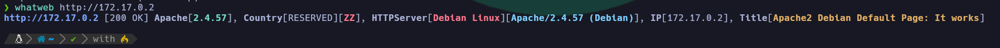

Decido comprobarlo en el navegador y efectivamente sale la página por defecto de apache2.

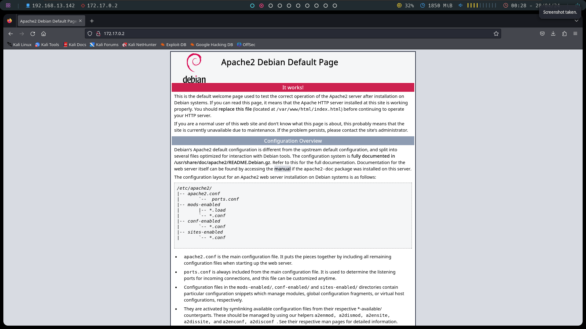

Dado a que me muestra la página por defecto de apache2 decido realizar fuzzing para ver si hay subdirectorios o archivos. Esto lo realizo con la herramienta gobuster.

```bash
gobuster dir -w /usr/share/dirbuster/wordlists/directory-list-2.3-medium.txt -u http://172.17.0.2 -x html,php,js
```
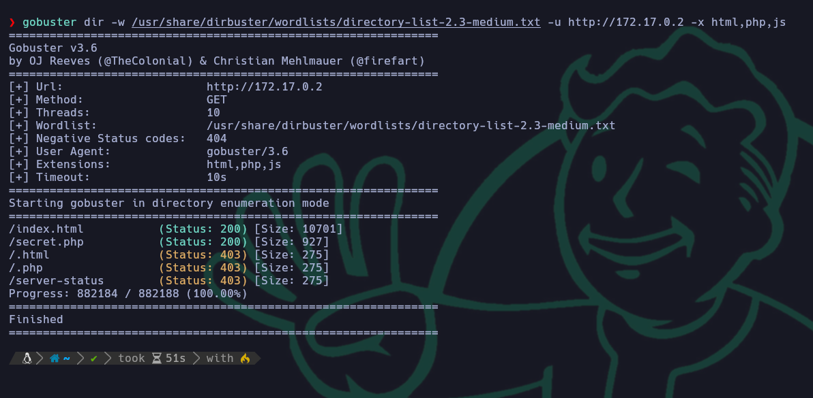

Una vez ejecutado veo que hay un archivo llamado "secret.php", así que decido acceder para ver que contiene.

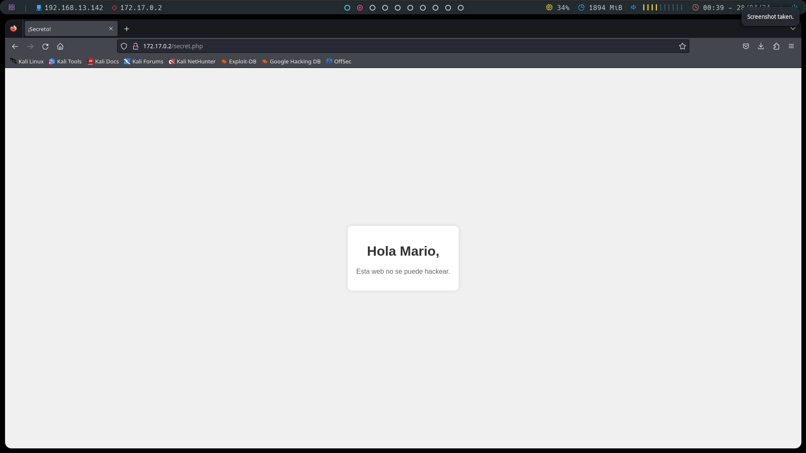

Dentro del archivo veo un comentario a un tal Mario, así que supongo que es un usuario. De todas formas también miro el código fuente en búsqueda de algún comentario en el código, pero no encuentro nada.

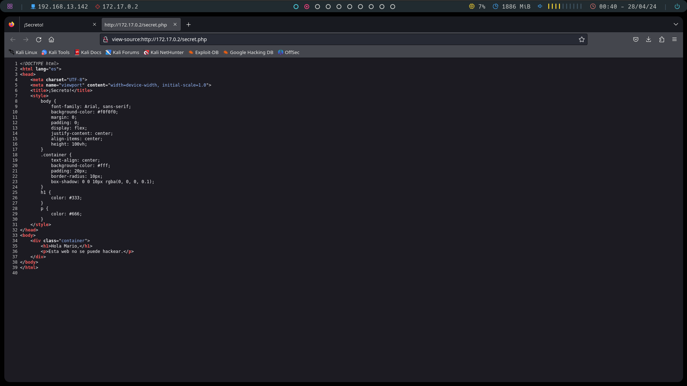

Viendo que no encuentro nada más intento entrar por ssh con el usuario mario por fuerza bruta utilizando el diccionario de contraseñas rockyou.txt, esto lo hago con la herrmienta hydra. Al poco tiempo de ejecutarlo consigue sacar la contraseña, en este caso era "chocolate".

```bash
hydra -l mario -P /usr/share/wordlists/rockyou.txt ssh://172.17.0.2
```

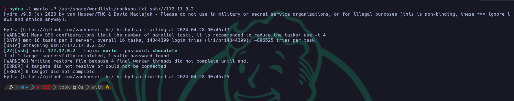

Ya sabiendo la contraseña entro por ssh al servidor.

```bash
ssh mario@172.17.0.2
```

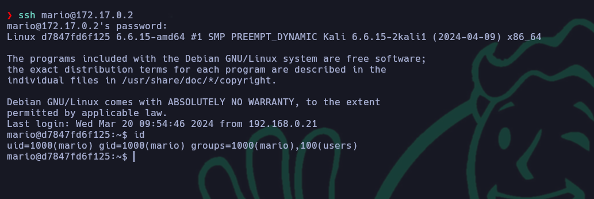

Estando dentro del sistema lo último que toca es escalar privilegios, así que lo primero que miro son los permisos que tienen los sudoers y veo que pueden ejecutar sin contraseña la herramienta de edicion de texto vim. Aqui me acorde de un ctf pasado donde con vim se podía ejecutar una bash y te la daba con los permisos del usuario que había ejecutado el vim, así que hice esa misma escalada.

```bash
sudo -l
```

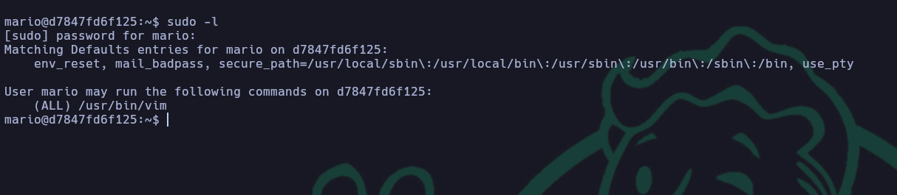

```bash
sudo -u root vim
```

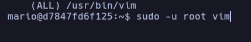

Dentro del bin en su consola interna ejecuto el siguiente comando: 

```bash
!/bin/bash
```

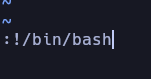

Una vez ejecutado consigo escalar privilegios y convertirme en el usuario root.

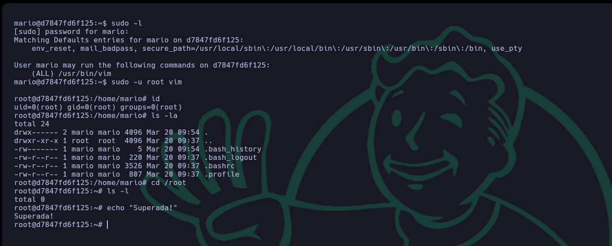